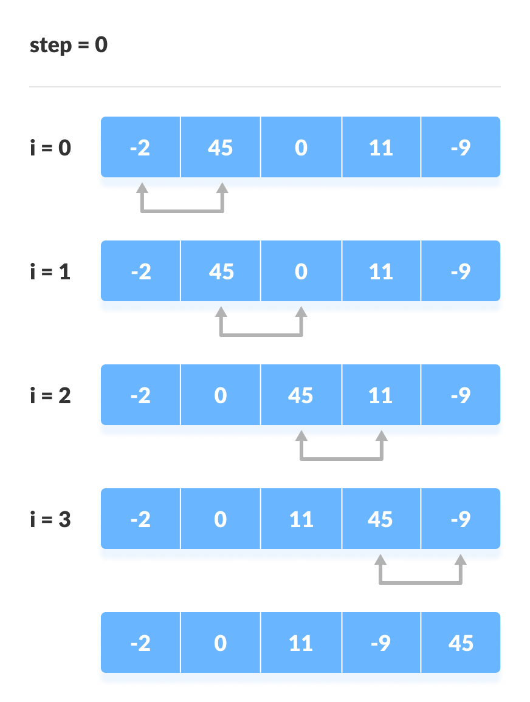
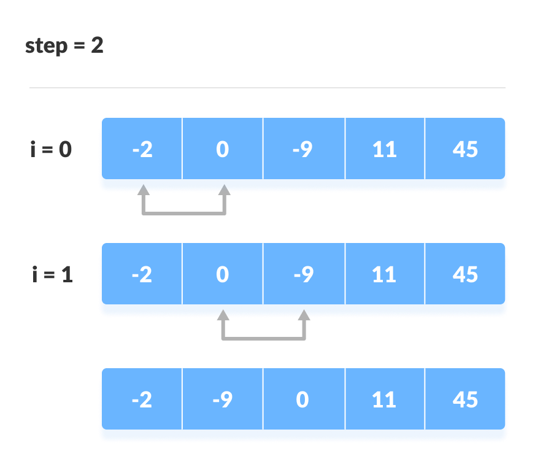
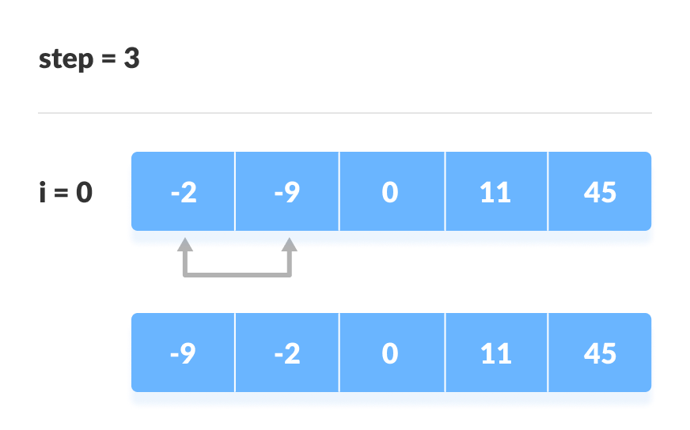

# Your homework:

## 1. Validating Credit Card Numbers
Have you ever wondered how websites validate your credit card
number when you shop online? They don’t check a massive database
of numbers, and they don’t use magic. In fact, most credit providers
rely on a checksum formula for distinguishing valid numbers from
random collections of digits (or typing mistakes).

To implement the validation algorithm for
credit cards follow next steps:

- Double the value of every second digit beginning from the right.
That is, the last digit is unchanged; the second-to-last digit is doubled; the third-to-last digit is unchanged; and so on. For example,
[1,3,8,6] becomes [2,3,16,6].
- Add the digits of the doubled values and the undoubled digits from the original number. For example, [2,3,16,6] becomes
2+3+1+6+6 = 18.
- Calculate the remainder when the sum is divided by 10. For the
above example, the remainder would be 8.
If the result equals 0, then the number is valid.

As a result one should implement a function which takes string representing card number and returns boolean.
Also cover this function with positive and negative tests

What array methods should be used for this exercise:
- https://developer.mozilla.org/en-US/docs/Web/JavaScript/Reference/Global_Objects/String/split
- https://developer.mozilla.org/en-US/docs/Web/JavaScript/Reference/Global_Objects/Array/map
- https://developer.mozilla.org/en-US/docs/Web/JavaScript/Reference/Global_Objects/Array/reduce

## 2. Table of sine and cose
In this section you should write a function which will print sin or cos table in a specified range and with a particular precision.
To accomplish this task, next functions should be implemented:
### Function `printTable(array)` 
Takes an array of objects with the same properties and print table to console.
Each column in a table is a name of object's property and each record represents a particular object in the array.
Next array will be printed as follows:
```
let arr = [{angle: 90, real: 1, calculated: 0.99}, {angle: 30, real: 0.5, calculated: 0.501}]
>
|         angle |          real |    calculated |
|            90 |             1 |          0.99 |
|            30 |           0.5 |         0.501 |
```

The size of column must be 15 symbols and text inside cell must be aligned to the right side with one space before the border.\
To implement this function use `for in` instruction for create a record and `for` loop to create full table.\
### Function `generateTable(precision, from, to, customTrig, realTrig)` 
Takes precision of sin or cos function (in range from 0.001 to 1), from angle (can be from 0 to 360), to angle (can be from 0 to 360), trig function which calculates sin or cos of specified angle with the precision and `realTrig` is a standard trigonometric function `Math.sin()` or `Math.cos()`.\
 The `generateTable` returns array of objects with next structure: {angle: number, real: number, calculated: number}, where `real` field is got from realTrig and calculated -- from customTrig.\
 The step between angles is 10 degrees, it means if one pass from=0 and to=30 to generateTable, it will return objects for four angles: 0, 10, 20, 30.\
 To implement this function use `for` loop to iterate angles with step in 10 degrees.

### Your custom trig functions
1) sin:\
 
2) cos:\
 

 Where:
  - n! -- is factorial (arithmetic function) which do multiplication of all positive integers less than or equal to n, i.e. 4! = 4*3*2*1 = 24, 2! = 2*1 = 2 (note 0! = 1)
  -  -- is summation symbol which just sum up all elements under the sigma, for example:\
   
   
 The function signature is `sin(angle, precision)`, angle is measured in radians so to convert degrees to radians use next formula:\
 `angle in radians = ((angle in degrees) * PI) / 180`

 To implement this function use `while` loop to sum up elements of the equations described above and `while` condition is current element is greater then the precision.

So in the end the four function must be implemented, example usage:

```javascript
function customSin(angle, precision) { ... }
function customCos(angle, precision) { ... }
function generateTable(precision, from, to, customTrig, realTrig) { ... }
function printTable(array) { ... }

let arrayOfSin = generateTable(0.01, 0, 90, customSin, Math.sin);
printTable(arrayOfSin);
```

  Useful links:
  
- radians -- https://www.mathsisfun.com/geometry/radians.html
- factorial -- https://www.mathsisfun.com/numbers/factorial.html
- sum notation -- https://www.mathsisfun.com/algebra/sigma-notation.html
- (optional) sine, cosine and tangent -- https://www.mathsisfun.com/sine-cosine-tangent.html

## 3. Sorting employees
There is a global variable named employee which contains array of objects having next structure:

```javascript
{
   "name": "Aaron,Kareem D",
   "jobTitile": "Utilities Inst Repair I",
   "deptId": "A50550",
   "descr": "DPW-Water & Waste Water (550)",
   "hireDate": Date(),
   "net": 32470,
   "gross": 25743.94
}
```

One should implement sort function which takes array and sort it by a particular field using comparator, the signature of function looks as follows:
```javascript
function sort(array, comparator) {
   ...
}
```
The comparator is also a function which takes to employee object and tells who is grater based on some field. The signature:

```javascript
function comparator(emp1, emp2) {
   ...
}
//return 1 -- emp1 is greater then emp2
//return 0 -- emp1 equals emp2
//return -1 -- emp1 is less then emp2
```

To implement sorting one will use the bubble sort algorithm.
The algorithm steps for:

1. Starting from the first index (0)
2. Compare the current and the next elements.
3. If the current element is greater than the elements element, they are swapped.
4. Increase the index
5. If the index is the size of array then finish processing otherwise move to step 2

In the end of this loop the largest element among the unsorted elements is placed at the end.
But to get all elements in the array sorted we need to repeat above steps (1-5) on sub-array - original array without last element.

Number of the reception is equal to the original array length, so on each iteration the sorted elements will gather in the tail of the array.

For better underspending here is pectoral example on array of size 4:





And animation:


So as result of this task one should implement sort function, and three comparators for name, gross and hireDate fields.
Also as an additional task all implemented functions are recommended to cover with neg and pos tests.

Useful links:
- compare strings in JS -- https://developer.mozilla.org/en-US/docs/Web/JavaScript/Reference/Global_Objects/String/localeCompare
- compare dates in JS -- https://stackoverflow.com/a/493018